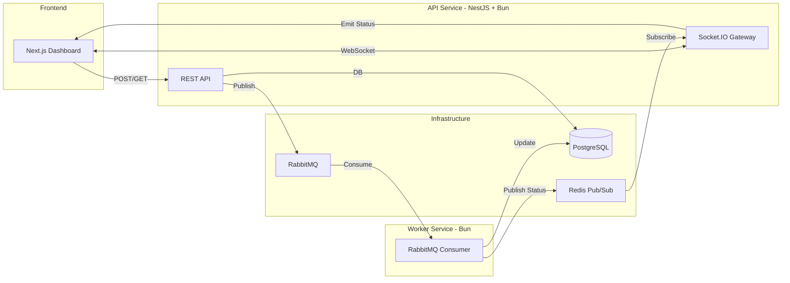

# Mini Messaging Platform — Technical Assessment

A production-quality mini messaging platform demonstrating event-driven architecture, real-time communication, and clean fullstack engineering.

---

## 🚀 Quick Start (Docker Compose)

The entire platform is orchestrated via Docker Compose. Ensure you have Docker running on your system.

```bash
# Clone the repository
git clone <repo-url>
cd messaging-test

# Copy environment variables (Required for local development and docker-compose)
cp api-service/.env.example api-service/.env && \
cp worker-service/.env.example worker-service/.env && \
cp frontend/.env.example frontend/.env

# Start the entire stack
docker compose up --build -d
```

Access the platform:

- **Frontend Dashboard**: [http://localhost:3000](http://localhost:3000)
- **API Service**: [http://localhost:3001/api](http://localhost:3001/api)
- **RabbitMQ Management**: [http://localhost:15672](http://localhost:15672) (guest/guest)
- **Postgres**: localhost:5433 (user/password/messaging_db)

---

## 🏗️ Architecture Overview

The system consists of three main applications and three infrastructure services:



### 1. API Service (NestJS + Bun)

- Acts as the gateway for the frontend.
- Handles user registration and message submission.
- **Persistence**: PostgreSQL via Prisma ORM.
- **Queueing**: Publishes new messages to RabbitMQ (`messages.send`).
- **Real-time**: Subscribes to Redis pub/sub to push status updates to clients via Socket.IO.

### 2. Worker Service (Bun)

- Lightweight asynchronous processor.
- Consumes from RabbitMQ.
- **Simulation**: Implements 2-5s delay to mimic real-world delivery pipelines.
- **Lifecycle**: Updates message status (`queued` -> `processing` -> `sent`/`failed`).
- **Events**: Publishes every status change to Redis pub/sub.

### 3. Frontend (Next.js)

- Modern UI built with Tailwind CSS and Lucide icons.
- **Session**: Soft registration (Name + Phone) persisted in local storage.
- **Interactive**: Real-time status badges (with animations) that update without page refresh.
- **Responsiveness**: Fully adaptive layout for mobile and desktop.

---

## Features Implemented

| Feature                  | Details                                                           |
| ------------------------ | ----------------------------------------------------------------- |
| **Docker / Compose**     | Full orchestration with health checks and dependency management.  |
| **Redis**                | Used for real-time event distribution between Worker and API.     |
| **Retry / DLQ**          | RabbitMQ configured with NACK/requeue logic.                      |
| **Idempotency**          | `idempotencyKey` handling in API and Database unique constraints. |
| **Request Validation**   | Strict NestJS ValidationPipes with `class-validator`.             |
| **Logging**              | Structured logging with correlation context.                      |
| **ORM**                  | Prisma ORM with relational schema (Users <-> Messages).           |
| **NestJS**               | Clean modular architecture with Global filters and Providers.     |
| **Unit Tests**           | Service testing with NestJS TestingModule and Jest.               |
| **CI/CD**                | GitHub Actions workflow for Lint, Test, and Docker Build.         |
| **Cloud Readiness**      | 12-factor app compliance (env vars, Docker, health checks).       |
| **WebRTC Consideration** | Socket.IO gateway designed as a potential signaling server.       |

---

## 🛠️ Design Decisions & Trade-offs

- **Bun Runtime**: Chosen for both API and Worker for superior performance and developer experience, as mentioned as a preferred technology.
- **Soft Registration**: To keep the assessment focused on messaging, I implemented a phone-based identification system instead of full MFA/Auth.
- **Redis Pub/Sub**: Used Redis for status updates instead of direct API-Worker communication to ensure horizontal scalability; the API doesn't need to know which worker is processing which message.
- **Next.js Standalone**: Docker builds use Next.js standalone output for minimal image size (from ~1GB to ~100MB).

---

## 📡 Future Considerations (WebRTC Call Pipeline)

The current Socket.IO implementation is built to scale into a WebRTC signaling server.

1. **Signaling**: The Gateway can handle `offer`, `answer`, and `ice-candidate` exchange.
2. **State**: Redis can track active call sessions across multiple API instances.
3. **Turn/Stun**: Infrastructure would be expanded with CoTURN for NAT traversal.

## 🧪 Running Tests

### API Service (Jest)

```bash
cd api-service
bun install
bun x jest
```

### Worker Service (Bun Test)

```bash
cd worker-service
bun install
bun test
```

---

## 📦 Project Structure

```
messaging-test/
├── docker-compose.yml          # Full orchestration
├── .env.example                # Environment template
├── .github/workflows/ci.yml   # CI/CD pipeline
├── README.md
│
├── api-service/                # NestJS + Bun
│   ├── Dockerfile
│   ├── prisma/schema.prisma    # Database schema
│   └── src/
│       ├── main.ts             # Entry point
│       ├── app.module.ts       # Root module
│       ├── users/              # User registration
│       ├── messages/           # Messaging logic + read receipts
│       ├── queue/              # RabbitMQ publisher
│       ├── realtime/           # Socket.IO + Redis gateway
│       ├── prisma/             # Database service
│       ├── health/             # Health checks
│       └── common/             # Filters, interceptors
│
├── worker-service/             # Bun standalone
│   └── src/
│       ├── index.ts            # Entry point
│       ├── consumer.ts         # RabbitMQ consumer
│       ├── processor.ts        # Message processing logic
│       ├── prisma.ts           # Database client
│       └── redis-publisher.ts  # Status event publisher
│
└── frontend/                   # Next.js + Bun
    └── src/
        ├── app/page.tsx        # Main dashboard
        ├── components/         # UI components
        ├── hooks/              # useSocket, useUser
        ├── lib/api.ts          # HTTP client
        ├── context/            # User context
        └── types/              # Shared TypeScript types
```

---

## 👨‍💻 Author

Muhammad Fajar
Position: Software Engineer (Fullstack) Assessment
